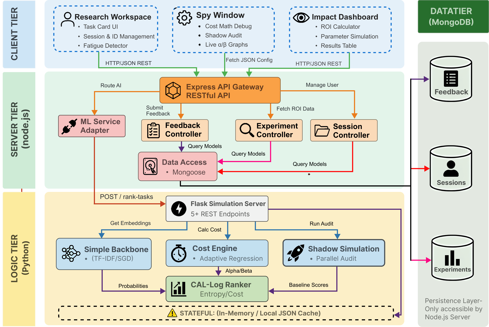

# CAL-Log: Cost-Aware Active Learning with Logarithmic Cost 📊


**CAL-Log** is an advanced research platform designed to empirically evaluate active learning strategies. Unlike traditional uncertainty sampling techniques, CAL-Log selects annotation tasks based on **information gain per unit of cognitive cost**, adapting dynamically to individual annotator reading speeds to minimize overall human effort.

---

## 🎯 Research Objectives

1. **Empirical Cost Optimization**: Demonstrate that a mathematically grounded cost-aware scoring engine reduces total annotation duration compared to baseline models.
2. **Fatigue Modeling**: Accurately predict and account for annotator fatigue using a dynamic Ordinary Least Squares (OLS) regression based on an alpha-beta logarithmic reading curve.
3. **Transparent Evaluation**: Provide absolute structural transparency to the evaluator via the "Spy Window", exposing real-time Shannon entropy values, cost penalty calculations, and dynamic algorithm clustering.

---

## 🏗️ 4-Tier Architecture

CAL-Log is implemented via a modern, strictly separated **4-Tier Architecture** prioritizing stateless scalability and high-performance computation.

1. **Presentation Tier (React + Vite)**
   - High-performance UI leveraging optimistic state updates for zero-perceived-latency task transitions.
   - Dynamic real-time data visualization via Recharts (SVG-based charting).
2. **Application Tier (Node.js + Express)**
   - Robust RESTful API orchestrating secure session state persistence, file payload proxying, and qualitative survey collection.
3. **Analytics & ML Tier (Python + Flask)**
   - Computationally intensive boundary isolating the CAL-Log ranking engine, RoBERTa classifiers, and mathematical cost matrix algorithms.
4. **Data Tier (MongoDB)**
   - Persistent NoSQL document storage retaining evaluator progress, tracking high-resolution interaction telemetry, and qualitative feedback logs.




---

## 📐 Core Mathematics & Cost Matrix

The Active Learning task selection is governed by the following mathematical constraints:

```text
Score(x) = Entropy(x) / Cost(x)

Cost(x)  = α + β · log(1 + Length(x))
```

- **Entropy(x)**: Shannon entropy derived from the RoBERTa-Base classifier’s soft-max margin outputs.
- **α (alpha)**: Fixed cognitive overhead penalty for task-switching (measured in seconds).
- **β (beta)**: Dynamic, per-word reading speed cost penalty. Update frequency is triggered every 5 consecutive text annotations using observed `Date.now()` telemetry points.

The matrix adapts rapidly: as annotator fatigue increases, the gradient penalty shifts, seamlessly favoring shorter informational tasks to mitigate exhaustion (`β > 3`), or supplying longer high-yield documents when the annotator enters a steady fast-reading state (`β < 1.5`).

---

## 🛠️ Prerequisites & Dependencies

To deploy the CAL-Log suite locally, ensure the host machine meets the following version specifications:

| Component | Minimum Version | Notes |
|-----------|-----------------|-------|
| **Node.js** | 18.x | Required for Vite and Express. |
| **Python** | 3.9+ | Required for Scikit-Learn pipelines. |
| **MongoDB** | 4.4+ | Atlas Cloud Cluster or Local Daemon. |
| **Git** | 2.x | Required for clone operations. |

---

## 🚀 Deployment Guide

Deploying the system requires initializing the three distinct runtimes in parallel.

### 1. Repository Setup
```bash
git clone <repo-url>
cd ResearchTool
```

### 2. Application Tier (Backend)
```bash
cd server
npm install
# Create a .env file linking to your MongoDB instance
cp .env.example .env
npm start # Initiates on http://localhost:5001
```

### 3. Analytics Tier (ML Service)
```bash
cd ml_service
pip install -r requirements.txt
python simulation_server.py # Initiates on http://localhost:9090
```

### 4. Presentation Tier (Frontend)
```bash
cd client
npm install
npm run dev # Initiates on http://localhost:5173
```

Ensure all terminals are running concurrently. Access the evaluator UI via `http://localhost:5173/spy`.

---

## 👤 Evaluator Protocol (User Guide)

When entering the platform for an active study session:
1. **Authentication**: Enter your uniquely assigned Contestant ID.
2. **Onboarding Briefing**: Review the modal defining the scope of CAL-Log evaluation and the mechanics of the dashboard.
3. **Task Adjudication**: Analyze the central workspace card and label tasks as *Positive* or *Negative*.
4. **Spy Analytics Monitoring**: Review the right-side Spy Panel observing:
   - Real-time Entropy/Cost ratios.
   - Live adjustments to the structural $\beta$ (beta) classification label (`Fast Skimmer`, etc).
   - Projected Financial ROI graphs mapped against Random baseline vectors.
5. **Debriefing**: Upon reaching the task threshold, generate the internal feedback survey, saving and securely clearing session state variables.

---

## 📂 Project Structure

```text
ResearchTool/
├── client/                     # Presentation Tier (React + Vite)
│   ├── src/
│   │   ├── components/         # Stateful React modules (TaskCard, ROICalculator)
│   │   └── pages/              # Primary Routes (ImpactDashboard)
├── server/                     # Application Tier (Node.js)
│   ├── infrastructure/
│   │   ├── http/routes/        # Secure routing endpoints
│   │   └── database/models/   # Mongoose structured schemas
├── ml_service/                 # Analytics Tier (Python)
│   ├── simulation_server.py    # Flask initialization vector
│   ├── cost_engine.py          # OLS fatigue tracking matrix
│   └── models/                 # Ranking and backbone structures
└── README.md                   # Core documentation
```

---

## 📚 Academic Citations

If you construct tools mapping to these implementations or algorithms, reference the foundation papers:

```bibtex
@INPROCEEDINGS{11454245,
  author={Kariyakaranage, Vihanga Supasan and Athuraliya, Banuka},
  booktitle={2026 International Conference on Artificial Intelligence in Information and Communication (ICAIIC)}, 
  title={AL-X0: Cost-Aware Active Learning for Cloud-Scale NLP via Zero-Shot Proxy Valuation}, 
  year={2026},
  volume={},
  number={},
  pages={657-662},
  keywords={Cloud computing;Adaptation models;Uncertainty;Costs;Annotations;Active learning;Text categorization;Brain modeling;Calibration;Cost accounting;Active learning;cost-aware learning;text classification;annotation efficiency;cloud computing},
  doi={10.1109/ICAIIC68212.2026.11454245}}

@INPROCEEDINGS{11499970,
  author={Kariyakaranage, Vihanga Supasan and Athuraliya, Banuka},
  booktitle={2026 IEEE International Research Conference on Smart Computing and Systems Engineering (SCSE)}, 
  title={CAL-Log: Calibration-Aware Logarithmic Cost Modeling for Active Learning in Low-Resource NLP}, 
  year={2026},
  volume={9},
  number={},
  pages={1-6},
  keywords={Filtering;Filters;Active filters;Band-pass filters;Protocols;HTTP;Modulation;Radio access networks;Regional area networks;Communication systems;Active learning;cost-aware annotation;text classification;low-resource language;model calibration},
  doi={10.1109/SCSE70081.2026.11499970}}

@INPROCEEDINGS{11502457,
  author={Kariyakaranage, Vihanga Supasan and Athuraliya, Banuka},
  booktitle={2026 IEEE 15th International Conference on Communication Systems and Network Technologies (CSNT)}, 
  title={Boundary Conditions of Cost-Aware Active Learning: A Multi-Dataset Taxonomy of Calibration and Length-Variance Failure Modes}, 
  year={2026},
  volume={},
  number={},
  pages={1317-1322},
  keywords={Telemetry;Aerospace and electronic systems;Communication systems;Protocols;Telemetry;Data communication;HTTP;Diversity methods;Communications technology;Active learning;Active Learning;Natural Language Processing;Computer Vision and AI;Data Mining;Text Classification},
  doi={10.1109/CSNT69054.2026.11502457}}

@INPROCEEDINGS{acl2026srw_callog,
  author={Kariyakaranage, Vihanga Supasan and Athuraliya, Banuka},
  booktitle={Proceedings of the 64th Annual Meeting of the Association for Computational Linguistics: Student Research Workshop (ACL SRW)},
  title={CAL-Log: Cost-Aware Active Learning with Logarithmic Cognitive Effort Modeling and Online Adaptation to Human Annotation Behavior},
  year={2026},
  address={San Diego, California, United States}
}
```

*Prepared and explicitly audited for the viva defense of the CAL-Log thesis study (2026).*
